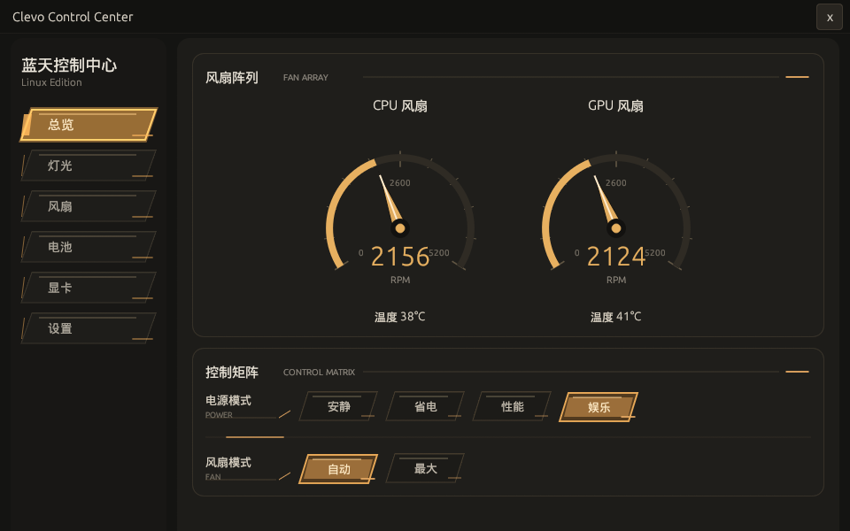
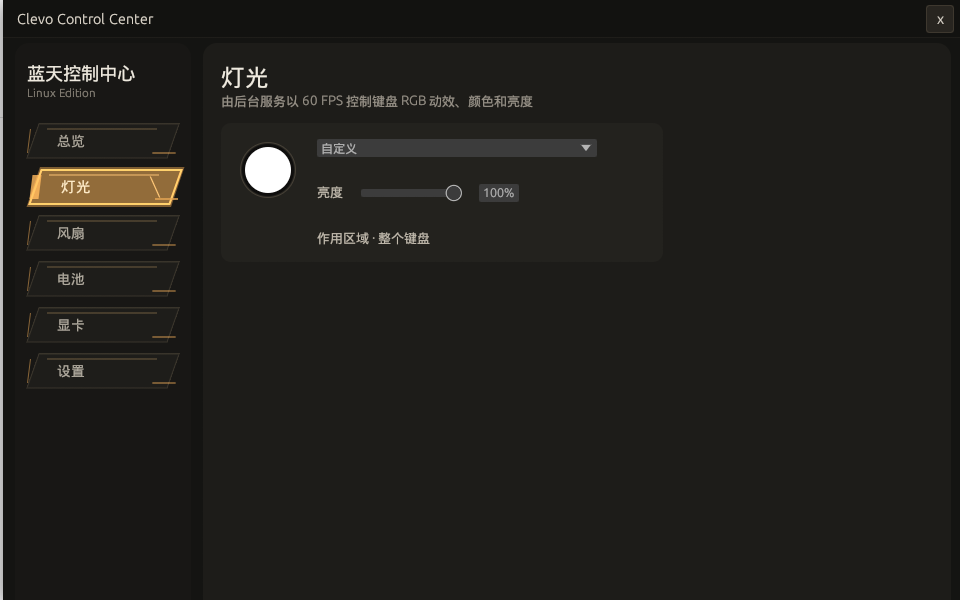
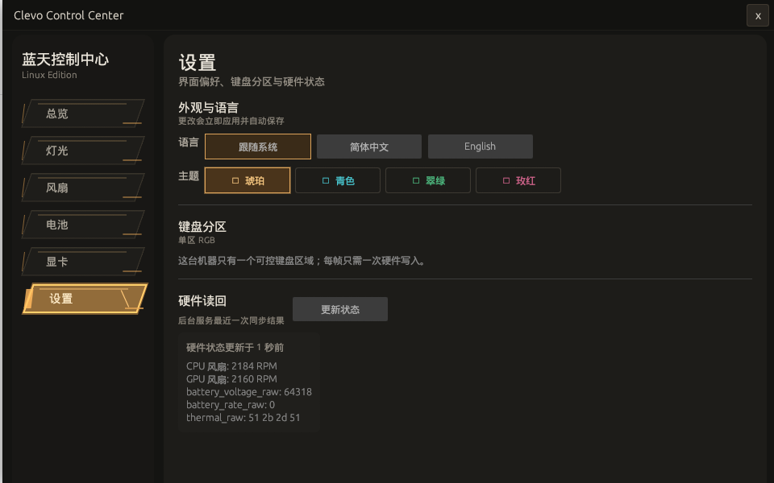

# Clevo Control Center for Linux

面向蓝天/Clevo/Insyde DCHU 笔记本的 Linux 控制中心。项目包含 Rust 图形界面、关闭 GUI 后仍可运行的灯光服务、受限硬件控制 CLI，以及调用 ACPI `_DSM` 的 Linux 内核模块。

> [!CAUTION]
> 本项目会向 BIOS/EC 固件发送控制命令，仍处于早期硬件验证阶段。错误或不兼容的写入可能造成散热异常、系统不稳定、无法启动，甚至需要 BIOS/EC 恢复。只应在确认属于兼容 Clevo 系机型、理解恢复方法并接受风险后使用；不要在非 Clevo 设备、虚拟机或未经验证的 BIOS/EC 上尝试。

本项目由社区独立开发，与 Clevo、蓝天电脑或任何品牌商不存在隶属、授权或担保关系。

## 界面预览

以下截图来自真实机器上的 Release 构建。Release 版不会显示内部“诊断”和“高级”页面。

| 总览 | 灯光 | 设置 |
| --- | --- | --- |
|  |  |  |

## 当前能力

| 功能 | 当前状态 | 行为边界 |
| --- | --- | --- |
| 硬件总览 | 已在实机验证 | 显示 CPU/GPU 风扇 RPM 与温度；第三路 tach 有数据时显示 PCH 风扇。 |
| 电源模式 | 已在实机验证 | 提供 Quiet、Power Saving、Performance、Entertainment 四种原厂模式。 |
| 风扇模式 | 已在实机验证 | 公开 Auto、Max，以及能力位允许时的 Silent/MaxQ。 |
| 自定义风扇曲线 | 实验性写入 | 风扇页只保存本地曲线；在总览选择曲线后才写 WMI14 并切换到 Custom。首点来自固件，末点固定为 `100°C/100%`，只编辑 T2/T3。 |
| 键盘 RGB | 单区实机验证 | 根据 WMI13 `KBTP` 识别单区、三区和逐键家族；目前支持单区/三区 RGB 写入，逐键类型只识别、不输出逐键灯效。 |
| 软件灯效 | 单区实机验证 | 后台服务以 15 ms deadline 生成循环、波浪、闪烁和呼吸帧，实测单区刷新率高于 60 FPS。 |
| GPU MUX | 实验性写入 | 只提供 `dGPU`/`MSHybrid`，确认后写入并立即请求重启。仅在原厂明确支持这些模式时使用。 |
| 电池策略 | 仅本地配置 | 保存阈值和策略意图到 `settings.json`；不写 EC、不切换系统电源计划。 |
| 语言与主题 | 已实现 | 默认跟随系统语言，可选简体中文/English；默认琥珀主题，可切换青色、翠绿或玫红。 |
| 诊断/高级页面 | 仅 Debug | Release 构建在类型和导航层面完全移除这两个内部页面。 |

## 已验证硬件与兼容边界

当前完整实机链路只在下列维护者设备上验证：

```text
sys_vendor:  Notebook
product:     NP5x_NP6x_NP7xPNP
board:       NP5x_NP6x_NP7xPNP
BIOS:        1.07.05
keyboard:    WMI13 KBTP=6（单区 RGB）
fan layout:  CPU + GPU 双风扇
GPU MUX:     dGPU / MSHybrid
```

其他使用 `\_SB.DCHU` 和相同 Insyde `_DSM` UUID 的 Clevo 衍生机型可能具备部分相同能力，但目前都应视为未验证。不同品牌外壳、相同产品系列名称或同为 Insyde BIOS 都不能单独证明兼容。

如果准备报告新机型，请先阅读 [贡献指南](CONTRIBUTING.md)，从 DMI 信息、只读状态和能力位开始，不要直接尝试未知写入。

## 快速开始

### 1. 获取源码

```bash
git clone https://github.com/pqcqaq/clevo-control-center-linux.git
cd clevo-control-center-linux
```

### 2. 准备环境

需要：

- Linux x86_64（当前预构建/打包流程以 x86_64/amd64 为主）；
- 稳定版 Rust 工具链：`cargo`、`rustc`；
- `make` 和当前运行内核对应的 headers，路径必须存在：`/lib/modules/$(uname -r)/build`；
- `pkexec`，供 GUI 在模块缺失或 API 过旧时请求桌面权限；
- `zenity` 或 `kdialog`，供模块处理提示和系统调色盘使用；
- 构建 `.deb` 时额外需要 `dpkg-deb`，构建 `.rpm` 时需要 `rpmbuild`；
- 完整 Release 需要 Docker，以 Debian Bullseye（glibc 2.31）基线构建跨发行版二进制；
- Arch 包需要 `makepkg`，缺少时脚本可通过 Docker 的 `archlinux:base-devel` 镜像构建；
- 生成正式 Release 时额外需要 `rustfmt`、`clippy`、`git` 和 `sha256sum`。

检查当前环境：

```bash
scripts/check-env.sh
```

内核模块不能跨内核版本直接复用，必须使用目标机器当前内核的 headers/Kbuild 构建。

### 3. 构建

同时构建内核模块和 Release 程序：

```bash
scripts/build.sh
```

等价的手动命令：

```bash
make -C module
cargo build --release
```

产物位于：

```text
module/clevo_control_center.ko
target/release/clevo-control-center
```

### 4. 运行

开发目录中启动 GUI：

```bash
scripts/run-gui.sh
```

首次启动且没有 `settings.json` 时，程序会先显示产品内免责声明。只有明确接受并成功保存默认配置后，程序才会检查/加载内核模块和启动后台服务。

## 打包与安装

### 通用 tar.gz

```bash
scripts/package-tar.sh
```

输出名称按 Cargo 版本和构建机架构生成，例如：

```text
dist/clevo-control-center-0.1.0-linux-x86_64.tar.gz
```

解包并执行用户级安装：

```bash
tar -xf dist/clevo-control-center-0.1.0-linux-x86_64.tar.gz -C /tmp
/tmp/clevo-control-center-0.1.0-linux-x86_64/install.sh
```

默认安装位置：

- 主程序和模块源码：`~/.local/lib/clevo-control-center/`
- 命令入口：`~/.local/bin/clevo-control-center`
- 桌面入口：`~/.local/share/applications/clevo-control-center.desktop`
- 用户文档和许可证：`~/.local/share/doc/clevo-control-center/`

安装脚本会在 headers 存在时编译模块；图形会话中通过 `pkexec` 请求安装/加载权限。卸载用户级文件：

```bash
/tmp/clevo-control-center-0.1.0-linux-x86_64/install.sh uninstall
```

### Debian/Ubuntu `.deb`

```bash
scripts/package-deb.sh
sudo apt install ./dist/clevo-control-center_0.1.0_amd64.deb
```

`.deb` 安装到：

- `/usr/bin/clevo-control-center`
- `/usr/lib/clevo-control-center/`
- `/usr/share/applications/clevo-control-center.desktop`
- `/usr/share/doc/clevo-control-center/`

`postinst` 只在 `make` 和当前内核 headers 都存在时尝试编译、安装并加载模块；缺失依赖时包仍会安装，但硬件功能不可用，需补齐 headers 后重新安装或手动构建模块。

### Fedora/RHEL 9+/openSUSE `.rpm`

```bash
scripts/package-rpm.sh
sudo dnf install ./dist/clevo-control-center-0.1.0-1.x86_64.rpm
```

openSUSE 可以使用 `sudo zypper install ./dist/clevo-control-center-0.1.0-1.x86_64.rpm`。RPM 安装脚本会在目标系统存在当前内核 build 目录时编译模块；Fedora/RHEL 系通常需要安装与当前内核匹配的 `kernel-devel`。当前 Release 的 glibc 基线不覆盖 glibc 2.28 的 RHEL/Rocky/Alma 8，只支持 9 及更新版本。

### Arch Linux/Manjaro `.pkg.tar.zst`

```bash
scripts/package-arch.sh
sudo pacman -U ./dist/clevo-control-center-0.1.0-1-x86_64.pkg.tar.zst
```

脚本优先调用本机 `makepkg`；非 Arch 构建机可用 Docker 自动进入官方 `archlinux:base-devel` 镜像。目标机器仍需安装当前内核对应的 headers，例如 `linux-headers` 或 `linux-lts-headers`。

### 正式 Release 产物

在干净且已经提交的 Git 工作区运行：

```bash
scripts/package-release.sh
```

如果当前 Linux 打包机没有 `rustfmt`/`clippy`，但同一提交已经在其他环境通过完整门禁，可以显式只构建产物：

```bash
scripts/package-release.sh --skip-checks
```

`--skip-checks` 不放宽 Git 要求：所有会进入公开仓库和源码包的文件仍必须已提交；本地被 `.gitignore` 排除的协作记录不会阻止打包。发布前应保留一份完整门禁结果。

该脚本会依次运行 Rust 格式、check、严格 Clippy、测试、内核模块 `W=1` 构建，然后生成：

```text
dist/clevo-control-center-<version>-source.tar.gz
dist/clevo-control-center-<version>-linux-<arch>.tar.gz
dist/clevo-control-center_<version>_<deb-arch>.deb   # 安装了 dpkg-deb 时
dist/clevo-control-center-<version>-1.<rpm-arch>.rpm # 安装了 rpmbuild 时
dist/clevo-control-center-<version>-1-<arch>.pkg.tar.zst
dist/RELEASE_ASSETS.txt
dist/SHA256SUMS
```

源代码包通过 `git archive HEAD` 创建，因此脚本拒绝脏工作区，避免源码、二进制和版本元数据不一致。Release 二进制在 Docker 的 Debian Bullseye 中构建，兼容基线为 glibc 2.31；通用、Debian、RPM 和 Arch 包复用同一二进制，都会携带模块源码、README、贡献指南、安全策略和 GPL-2.0-only 许可证，不会携带构建机生成的 `.ko`。

## 模块加载与版本

手动加载当前构建产物：

```bash
sudo insmod module/clevo_control_center.ko
cat /proc/clevo_control_center_version
```

当前用户态要求模块 API 8。GUI 会读取版本节点；模块缺失或 API 过旧时会提示并通过 `pkexec` 重新编译、安装和加载项目随附的模块源码。

卸载模块：

```bash
sudo rmmod clevo_control_center
```

公开 proc 节点：

| 节点 | 权限 | 用途 |
| --- | --- | --- |
| `/proc/clevo_control_center_version` | `0444` | 模块 API 版本。 |
| `/proc/clevo_control_center_led` | `0666` | 键盘颜色和亮度白名单写入。 |
| `/proc/clevo_dchu_status` | `0444` | 实时风扇 tach、温度和状态 buffer。 |
| `/proc/clevo_dchu_config` | `0444` | WMI13 配置、能力位、MUX 状态。 |
| `/proc/clevo_dchu_app_settings` | `0444` | 受限的电源/风扇模式运行时镜像。 |
| `/proc/clevo_dchu_control` | `0666` | 风扇、电源、曲线和 GPU MUX 白名单命令。 |

模块不公开任意 DCHU function、任意 AppSettings offset 或裸 payload。协议、映射和安全边界详见 [DCHU_ADJUSTMENTS.md](DCHU_ADJUSTMENTS.md)。

## DCHU CLI

只读命令：

```bash
target/release/clevo-control-center dchu status
target/release/clevo-control-center dchu app-settings
```

写入命令必须显式附带 `--i-understand`：

```bash
target/release/clevo-control-center dchu fan-mode auto --i-understand
target/release/clevo-control-center dchu power-mode 2 --i-understand
target/release/clevo-control-center dchu fan-curve \
  40:32,58:42,78:72,100:100 \
  42:25,60:44,80:74,100:100 \
  --i-understand
target/release/clevo-control-center dchu gpu-mux mshybrid --i-understand
```

内核会在写入前重新读取 WMI13，并用 CPU/GPU1/GPU2 各自的真实首锚点替换命令中的第一个点，同时把末点固定为 `100°C/100%`；命令中的 T2/T3 仍必须高于实际锚点，否则写入会被拒绝。GPU MUX CLI 只负责写入，不像 GUI 那样显示确认框或自动重启。

## 运行时设计

```text
GUI ───────────────┐
后台灯光服务 ──────┼─> HardwareBackend ─> Linux /proc 接口 ─> 内核模块 ─> ACPI _DSM
DCHU CLI ──────────┘
```

- 同一个 Rust 二进制提供 GUI、`--service` 后台模式和 `dchu` CLI。
- GUI 负责编辑/保存设置；动态灯效只由后台服务串行写入，因此关闭 GUI 后灯效仍继续。
- 服务使用 pid/lock 保持单例，并由独立线程每 2 秒刷新硬件快照。
- 软件灯效以 15 ms deadline 调度；落后时跳过过期帧，避免累计漂移。
- `HardwareBackend` 隔离业务层与 Linux `/proc` 文本协议。当前只有 Linux 后端，没有 Windows/DLL 实现。

## 配置与运行时文件

- 配置：`${XDG_CONFIG_HOME:-~/.config}/clevo-control-center/settings.json`
- pid/lock/硬件快照：`${XDG_RUNTIME_DIR:-/tmp/clevo-control-center-$(id -u)}/clevo-control-center/`
- 服务日志：`${XDG_STATE_HOME:-~/.local/state}/clevo-control-center/clevo-control-center.service.log`

程序会迁移旧的 `~/.config/clevo-keyboard-led/settings.json` 或开发目录中的旧版 `settings.json`。成功迁移的用户不会重复看到首次启动免责声明。

自定义风扇曲线和电池页面策略都保存在 `settings.json`。区别是：总览选择风扇曲线时会执行硬件写入；电池策略在当前版本始终只保存在本地。

## 开发与质量检查

Rust 门禁：

```bash
cargo fmt --check
cargo check --all-targets --all-features
cargo clippy --all-targets --all-features -- -D warnings
cargo test --all-targets --all-features
```

内核模块门禁：

```bash
make -B -C module W=1
```

仓库提供 `.vscode/settings.json` 和扩展建议。Windows 本地编辑器缺少 Linux 内核头时，`module/clevo_control_center.c` 的红线通常是解析环境问题；应通过 VS Code Remote SSH 在目标 Linux/Kbuild 环境验证，而不是添加虚假 Windows include path 或关闭整个工作区诊断。

代码按业务职责组织，不使用 `helpers.rs`、`utils.rs`、`common.rs` 收纳零散逻辑。完整约定和硬件改动证据要求见 [CONTRIBUTING.md](CONTRIBUTING.md)。

## 常见问题

### GUI 可以启动，但灯光或硬件控制无效

```bash
cat /proc/clevo_control_center_version
ls -l /proc/clevo_control_center_led /proc/clevo_dchu_control
```

节点缺失表示模块未加载；API 小于 8 表示模块过旧。重新打开 GUI 完成桌面认证，或在当前内核 headers 环境手动重建和加载模块。

### 动态灯效在关闭 GUI 后停止

```bash
scripts/run-service.sh
```

检查服务日志：

```bash
less "${XDG_STATE_HOME:-$HOME/.local/state}/clevo-control-center/clevo-control-center.service.log"
```

### 系统调色盘或模块处理提示打不开

安装 `zenity` 或 `kdialog`，并确认当前桌面会话可用。模块升级还需要 `pkexec` 和有效的 polkit 认证代理。

### 内核模块构建失败

```bash
uname -r
ls -ld "/lib/modules/$(uname -r)/build"
make -B -C module W=1
```

headers 必须与当前正在运行的内核一致。不要分发其他内核上编译的 `.ko`。

## 参与贡献与安全报告

- 功能、兼容性和普通缺陷：GitHub Issues
- 代码贡献：[CONTRIBUTING.md](CONTRIBUTING.md)
- 安全漏洞：[SECURITY.md](SECURITY.md)
- 维护者联系：`qcqcqc@zust.online`

## 许可证

本项目按 [GNU General Public License v2.0 only](LICENSE)（SPDX：`GPL-2.0-only`）发布。
